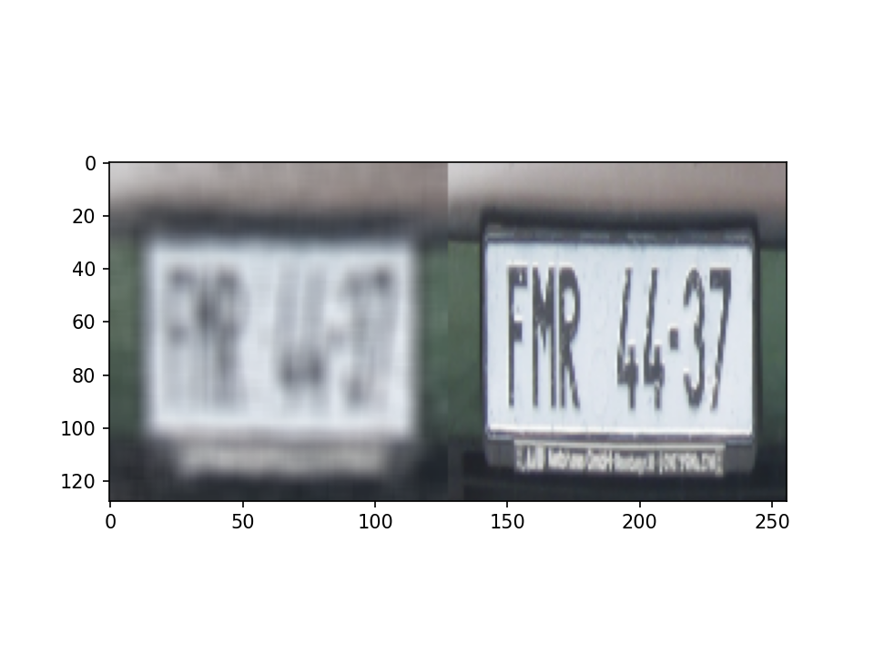

# text-image-denoiser

*deep learning models trained to denoise/deblur text images (signle frame, multi-frame)* **[pytorch]**

benchmark dataset: [LP HDR dataset](http://academictorrents.com/details/8ed33d02d6b36c389dd077ea2478cc83ad117ef3) 

#### Model-1: U-Net

- [x] s&p + gaussian blur
- [x] single frame
- [ ] real noise map

##### Loss plot

##### Denoised samples

  

    
  

  

    
  

  

    
  

  

.image-div{
  float:left;
  margin-right:10px;
  max-width: 20%;
  max-height: 20%;
}

